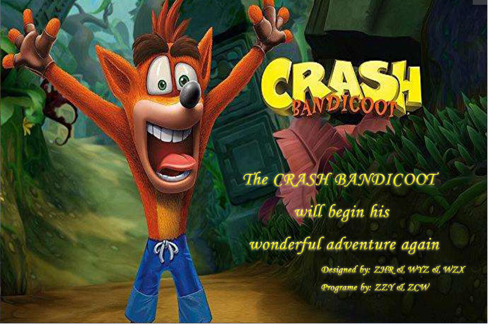
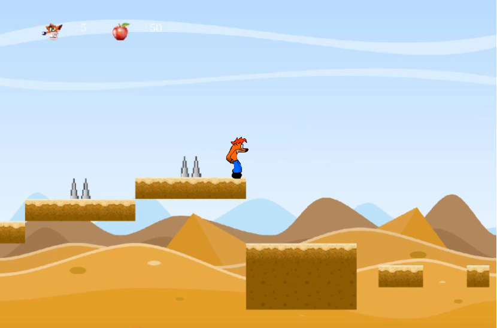
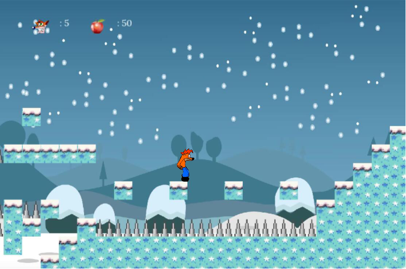
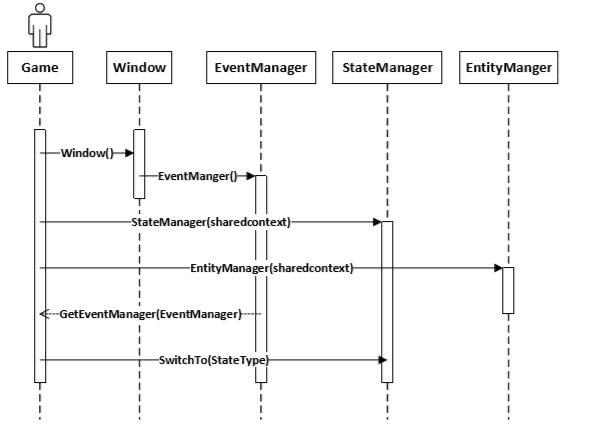
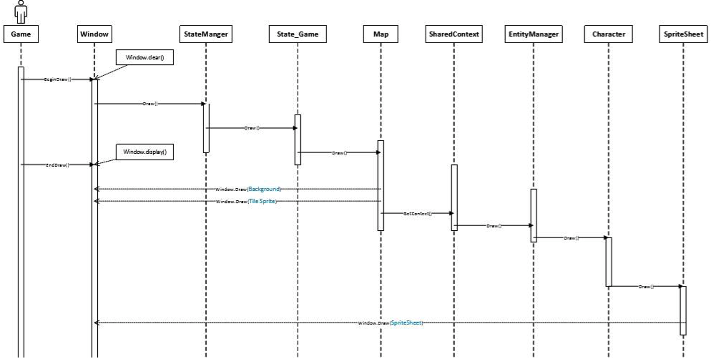
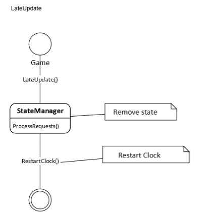

# 古惑狼2D重制版

### Game Introduction

The game is mostly set on the fictitious Wumpa Islands, an archipelago situated to the south of Australia where humans and mutant animals co-exist, although other locations are common. The main games in the series are largely platformers, but several are spin-offs in different genres. The protagonist of the series is a genetically enhanced bandicoot named Crash, whose quiet life on the Wumpa Islands is often interrupted by the games' main antagonist, Doctor Neo Cortex, who created Crash and wants him dead as he is a failed.

In the desert mode, the protagonist will encounter various enemies such as ground thorns and piranhas. His mission is to escape heavy levels and escape enemy pursuits, collecting as many apples as possible. Come and help him survive!

In the grassland mode, the protagonist will encounter various enemies, such as crabs and so on. His task is to escape heavy tasks and escape enemy pursuits, collect as many apples as possible. To help him survive!

In the snow mode, the protagonist will encounter various enemies, such as snow and so on. His task is to escape heavy tasks and escape enemy pursuits, collect as many apples as possible. To help him survive!

Scattered throughout each level are various types of crates, most of which contain items such as Wumpa Fruit and Aku Aku masks, which can be broken by jumping on or spinning into them.Other types of crate include checkpoint crates, which lets players resume their progress after losing a life, arrow crates which Crash can bounce on, and explosive TNT crates that explode upon being broken, or following a timer that activates by jumping on them. Certain crates, including steel platform crates, are invisible, requiring the player to hit an exclamation box to make them tangible. If the player clears a level with all crates broken without dying, they will earn a gem. Additional gems can be obtained through hidden levels or alternative routes, and some gems are required to access new areas. Collecting all gems in the game allows the player to reach its true ending.If the player manages to collect enough bonus icons, they will be warped to a Bonus Stage which, upon completion, will allow the player to save their progress, either via memory card or password.

### Game Architecture Design

This is the main framework for the project

As the flow chart shows, our game framework consists of Update, Render, and LateUpdate.

In this project, we used advanced game design ideas to set up the event manager, state manager, entity manager, Resource manager.

The State manager is responsible for initializing the state, which includes the state of the game, the end of the game, the game menu, the game start screen, switching states, and deleting states.

The Event manager is responsible for touching the mouse and keyboard in the game, taking the name of different events and binding events.

The Entity manager is used for loading, updating, and deleting different entities. This includes characters, different enemies, and different boxes.

The Resource manager is used to load, delete, and update resources.  The manager centralizes the loading of the image, and only the manager and image name are called in the game to find the image.

The interaction between Game and the manager is shown below.

The following shows the updates in the game

The following shows the rendering operations in the game

The following shows the time action in the game

This is my 2D Game.
Thank you for your reading.

