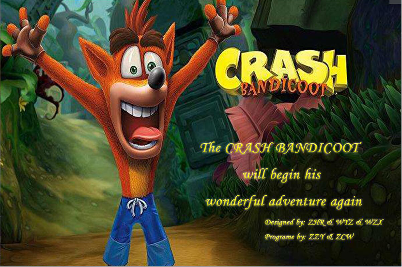
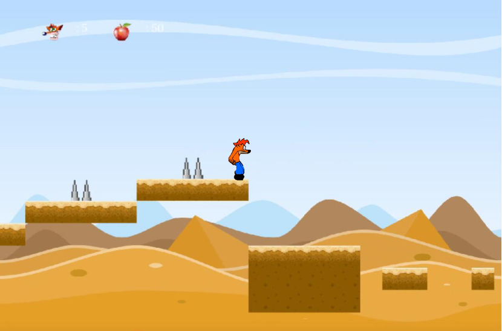
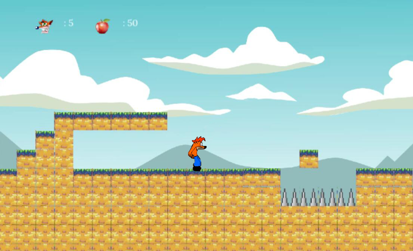
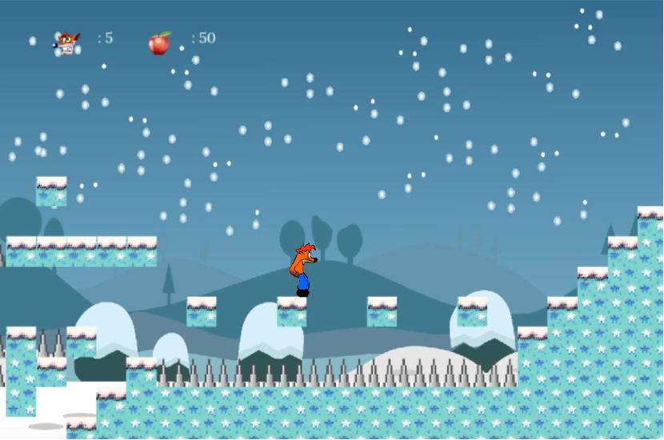
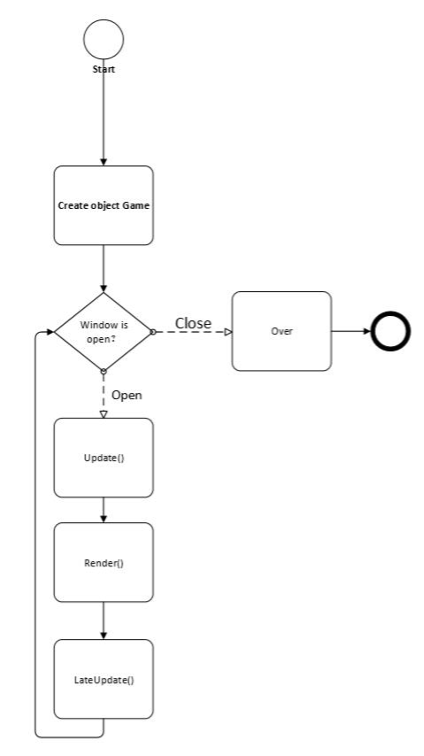
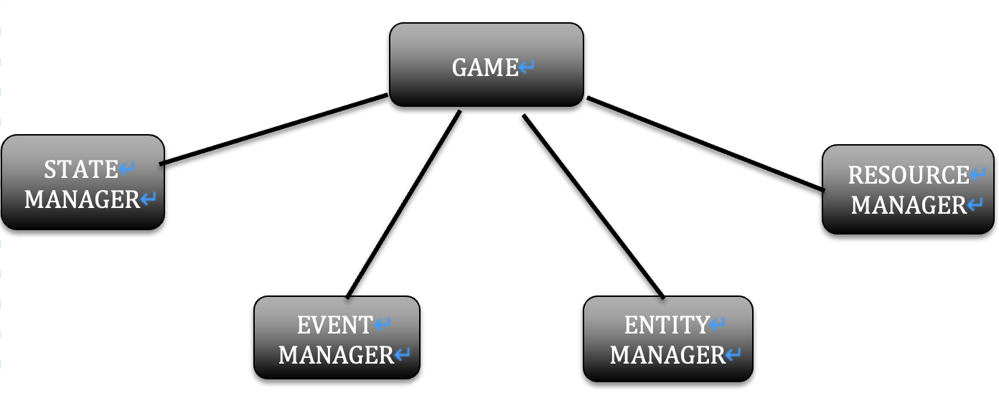
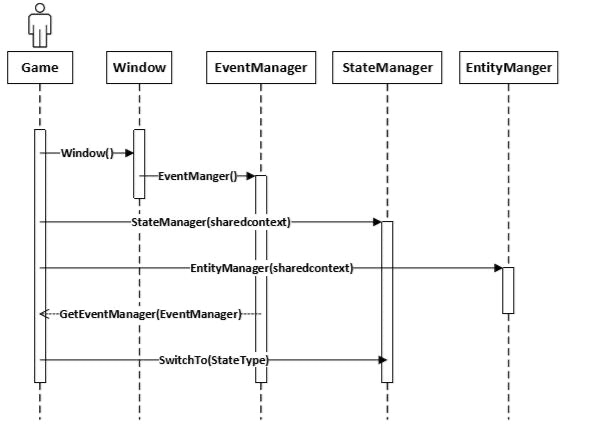
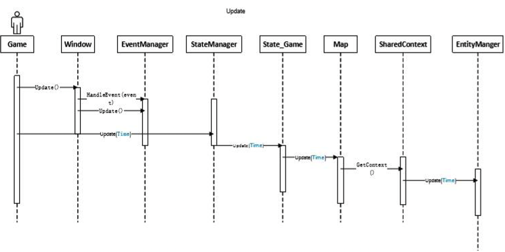
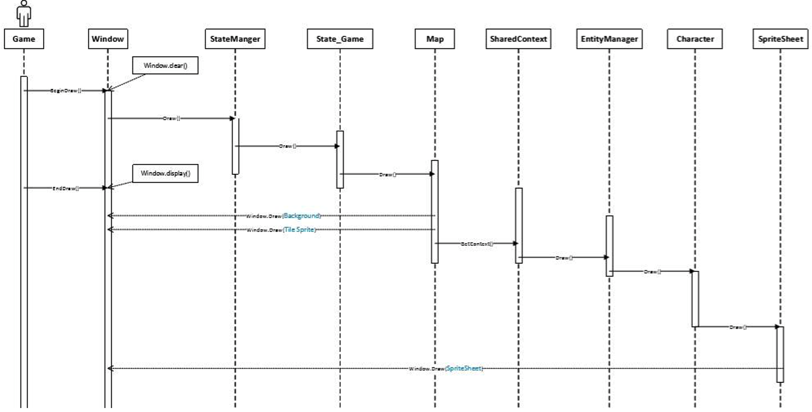
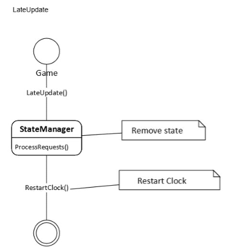

# 古惑狼2D重制版

### 游戏介绍

游戏主要设置在虚拟的乌帕群岛上，该群岛位于澳大利亚南部，是人类和变种动物共存的群岛，尽管其他地方很常见。 系列中的主要游戏是大型平台游戏，但也有一些是其他类型的产品。 该系列的主角是遗传改良的变种动物，名叫Crash（中文名为古惑狼），他在乌帕群岛上的安静生活经常被游戏的主要对手Neo Cortex医生打断，Neo医生创造了古惑狼，但由于古惑狼是实验失败品，Neo想把古惑狼除掉。

在沙漠模式下，主角会遇到各种各样的敌人，例如荆棘和食人鱼。 他的任务是逃避繁重的任务并逃脱敌人的追击，需要尽可能多地收集苹果，来帮助他生存。

在草原模式下，主角会遇到各种敌人，例如螃蟹等。 他的任务是逃避繁重的任务并逃脱敌人的追击，需要尽可能多地收集苹果，来帮助他生存。

在冰雪模式下，主角会遇到各种敌人和一些障碍，例如冰等。 他的任务是逃避繁重的任务并逃脱敌人的追击，需要尽可能多地收集苹果，来帮助他生存。

每个关卡中散布着各种类型的板条箱，其中大多数包含Wumpa Fruit（苹果）和Aku Aku面具之类的物品，可以通过跳动或旋转使这些板条来破碎，来获得物品。其他类型的板条箱包括关卡板条箱，在玩家失去生命后，可让玩家恢复进度。同时玩家也可以触发可以使C古惑狼弹跳的箭头板条箱，以及被破坏时爆炸的TNT板条箱，或者通过跳动而启动的计时器爆炸箱。

### 游戏框架设计

本项目是一款2D游戏，基于SFML开源游戏引擎开发，使用C++编程语言编写。

下图是我们游戏的主框架：

正如流程图显示的，我们的主框架实现主要包括 Update, Render, and LateUpdate三部分。

在这个项目中，我们使用了高级游戏设计思想来架构我们的游戏，我们构造了事件管理器，状态管理器，实体管理器，资源管理器（ event manager, state manager, entity manager, Resource manager）。

状态管理器（State manager）负责初始化状态，包括游戏状态，游戏结束，游戏菜单，游戏开始屏幕，切换状态和删除状态。

事件管理器（Event manager）负责监听游戏中的鼠标和键盘，并负责事件名称和相应绑定事件映射的处理。

实体管理器（Entity manager ）用于加载，更新和删除不同的实体。这包括角色，不同的敌人和不同的盒子。

资源管理器（Resource manager）用于加载，删除和更新资源。资源管理器集中图像的加载，并且在游戏中实现仅通过调用资源管理器和图像名称来调用图像的。

游戏进程和不同管理器之间的交互如下：

下图显示了游戏进程中Update的实现时序：

下图显示了游戏进程中图像渲染操作的实现时序：

下图显示了在游戏进程中时间的行为逻辑：

